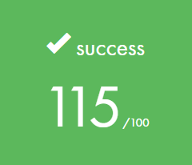

# Fract-ol

## Description

Découvrez la programmation 2D et l'univers psychédelique des fractales grâce à ce projet à réaliser avec la minilibX.

## Resultats

## Notes

Familiarise avec l'utilisation de la minilibx, premier projet graphique de l'école. Nécessaire de comprendre le fonctionnement des fractales. Très intéressant, manque d'optimisation.